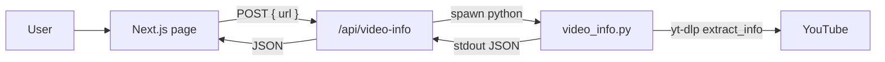

# YouTube Developer Trial Task

The workspace is empty besides the brief. Build a tiny full-stack demo that matches the PDF: Python metadata fetch, Next.js UI + API, short write-up. Wire Next.js to the real Python script (your choice), not a mock.

## Scope (do this, nothing more)

- Python CLI: URL in, yt-dlp metadata out as JSON
- Next.js page: input + Fetch, shows title / duration / views / upload date
- API route `/api/video-info` spawns the Python script
- Tailwind for clean, not pretty
- `WRITEUP.md` for Part 3
- Skip auth, DB, Redis, tests, deploy, extra pages

## Layout

```
D:\Python\Manos\
  scripts/video_info.py      # Part 1
  requirements.txt
  web/                       # Part 2 (create-next-app)
    app/page.tsx
    app/api/video-info/route.ts
  WRITEUP.md                 # Part 3
  README.md                  # run instructions
```

## Data flow



Shared JSON shape (Python prints this; the API returns it):

```json
{
  "title": "...",
  "duration": 312,
  "view_count": 1234567,
  "upload_date": "20240115"
}
```

Duration stays seconds from yt-dlp; the UI formats it as `m:ss` / `h:mm:ss`. Views get `toLocaleString()`. Upload date gets a readable format.

## Part 1 — Python (~45 min)

[`scripts/video_info.py`](scripts/video_info.py):

- Argparse: positional YouTube URL, optional `--out path` for the bonus file write
- Validate URL contains `youtube.com` or `youtu.be`
- `yt_dlp.YoutubeDL` with `quiet`, `no_warnings`, `skip_download` / `extract_info(..., download=False)`
- Pull `title`, `duration`, `view_count`, `upload_date`
- Print only JSON to stdout (so Next.js can parse it)
- Exit non-zero with `{"error": "..."}` on bad URL or extract failure

[`requirements.txt`](requirements.txt): `yt-dlp` only.

Manual check: `python scripts/video_info.py "https://www.youtube.com/watch?v=..." --out sample.json`

## Part 2 — Next.js (~60 min)

Create the app with `create-next-app` in `web/` (App Router, TypeScript, Tailwind, no extra extras).

[`web/app/api/video-info/route.ts`](web/app/api/video-info/route.ts):

- `POST` JSON `{ url: string }`
- Reject empty / non-YouTube URLs with 400
- `spawn` `python` (or `PYTHON_BIN` env) on `../scripts/video_info.py` with a ~20s timeout
- Parse stdout JSON; 502 if the process fails
- Return the metadata JSON

[`web/app/page.tsx`](web/app/page.tsx):

- URL input + Fetch button
- Loading and error states
- Result card: title, duration, views, upload date
- Basic Tailwind: centered card, readable type, no design system

Do not mock. If yt-dlp is missing, the API error is enough.

## Part 3 — Write-up (~15 min)

[`WRITEUP.md`](WRITEUP.md), a few sentences each:

1. Tooling: Cursor / this session — what was prompted vs written/fixed by hand
2. Production: validate URLs, timeout/kill the subprocess, cache by video id, rate-limit, never trust raw yt-dlp output, run Python as a worker not inside Next on serverless
3. What broke (fill after we run it) and how you'd debug further

[`README.md`](README.md): Python venv + `yt-dlp`, `npm run dev` in `web/`, example URL.

## What we will not do

No GitHub repo, zip, or Discord reply unless you ask. No extra features (thumbnails, player, history). No over-built error taxonomy.

## After you approve

Implement in that order: Python script first (prove JSON), then Next.js + API, then write-up after a real fetch.
